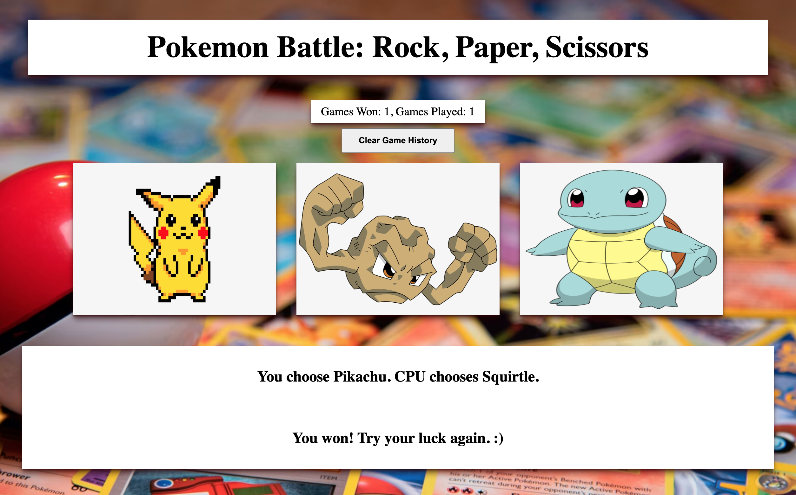
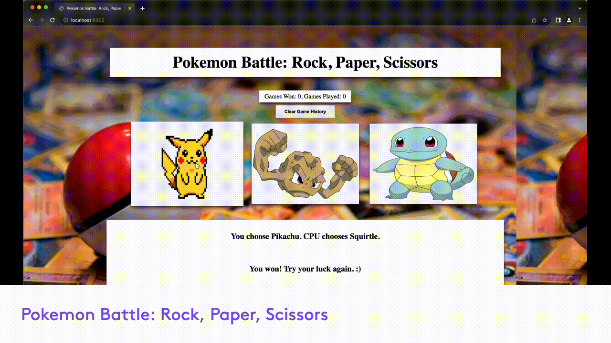

# Pokemon Battle: Rock, Paper, Scissors
Collaborative project to build a Pokemon rock, paper, scissors game.

### Screenshots

## How It's Made:

**Tech used:** HTML, CSS, JavaScript, Node.js

Our learning was focused on building a simple, full-stack project collaboratively with a remote team. Developed with the goal of making the game logic performed server-side.

## Optimizations
When this project is improved, we plan on refactoring our code using OOP principles.

## Lessons Learned:
It was amazing to work with other developers and be able to combine multiple ideas from each of our team members. With each teammate brining different strengths to the project we were able to learn a lot from each other that we can use on future projects.